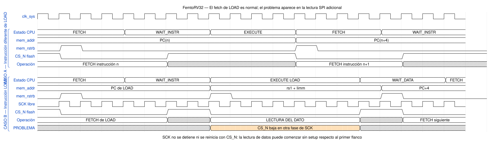
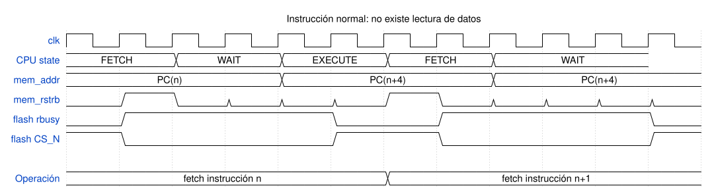
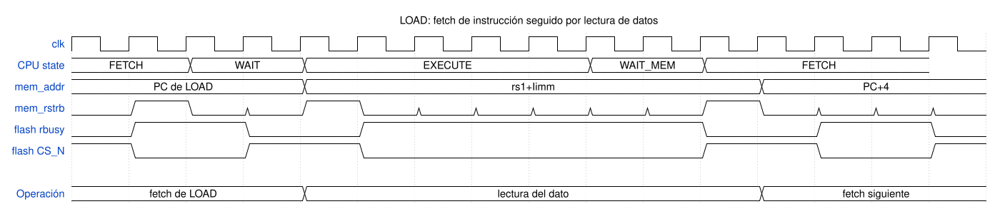
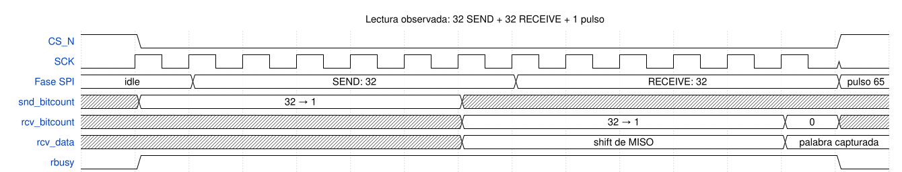
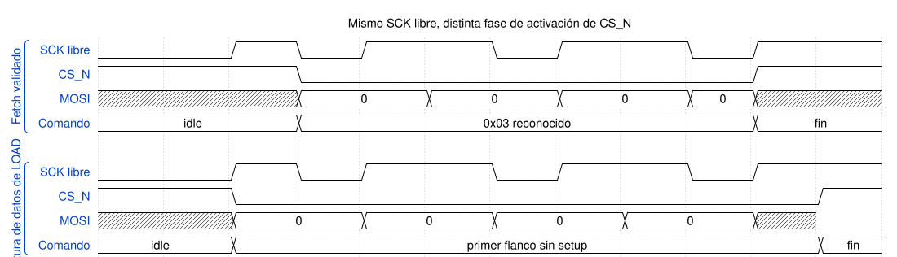

# Problemas encontrados en `MappedSPIFlash` y su efecto sobre `LOAD`

**Proyecto:** `tt_um_femto` — UNAL's RISC-V  
**Silicio:** Tiny Tapeout SKY 25b, mux 238  
**Módulos:** `MappedSPIFlash.v`, `femtorv32_quark.v`, `femto.v`  
**Fuente principal:** [`bugs_MappedSPIFlash.md`](../femtoRV/bugs_MappedSPIFlash.md)

## 1. Resumen

Se identificaron tres problemas observables:

| Problema | Evidencia | Efecto |
|---|---|---|
| Pulso SPI adicional al terminar `RECEIVE` | 65 pulsos con `CS_N=0`: 32 de envío, 32 de recepción y uno de salida | Latencia adicional; el RTL no captura el pulso 65 en `rcv_data` |
| `SCK` libre y no sincronizado con `CS_N` | El comando `0x03` fue observado como `0x06` después del reset | La flash no reconoce la lectura o entrega una palabra desplazada |
| Lecturas ejecutadas por `LOAD` fallan | `lb`, `lbu`, `lh`, `lhu` y `lw` retornan `0xFF`, incluso desde la dirección cero | Impide usar `.rodata`, tablas y cadenas almacenadas en flash |

La relación entre estos problemas es importante:

> El *fetch* de una instrucción `LOAD` es igual al de cualquier otra
> instrucción. La diferencia aparece después de decodificarla: durante
> `EXECUTE`, el CPU inicia inmediatamente una segunda transacción SPI para leer
> el dato ubicado en `rs1 + Iimm`.



Fuente WaveDrom: [`femtorv_fetch_load_comparison.json`](femtorv_fetch_load_comparison.json)

## 2. Secuencia del CPU

### 2.1 Instrucción diferente de `LOAD`

La secuencia es:

```text
FETCH_INSTR → WAIT_INSTR → EXECUTE → FETCH_INSTR
```

`mem_rstrb` se activa durante `FETCH_INSTR`. Después de `EXECUTE`, el siguiente
acceso a la flash corresponde al *fetch* de la siguiente instrucción.



Fuente WaveDrom: [`femtorv_normal_instruction.json`](femtorv_normal_instruction.json)

### 2.2 Instrucción `LOAD`

La secuencia es:

```text
FETCH_INSTR → WAIT_INSTR → EXECUTE LOAD → WAIT_ALU_OR_MEM → FETCH_INSTR
```

El RTL combinacional del CPU produce:

```verilog
// FETCH_INSTR
mem_rstrb = 1;
mem_addr  = PC;

// EXECUTE
mem_rstrb = isLoad;
mem_addr  = loadstore_addr;  // rs1 + Iimm
```

Por tanto existen dos lecturas consecutivas:

1. lectura de la palabra que codifica la instrucción `LOAD`;
2. lectura de la palabra que contiene el dato solicitado.



Fuente WaveDrom: [`femtorv_load_instruction.json`](femtorv_load_instruction.json)

## 3. Problema 1: pulso 65

### 3.1 Causa RTL

`SEND` anticipa su salida cuando el contador vale uno:

```verilog
if (snd_bitcount == 1) begin
    rcv_bitcount <= 6'd32;
    state        <= RECEIVE;
end
```

`RECEIVE`, en cambio, espera un evento adicional de `clk_div` para detectar que
el contador ya llegó a cero:

```verilog
if (rcv_bitcount == 0) begin
    state <= START;
end else begin
    rcv_bitcount <= rcv_bitcount - 6'd1;
    rcv_data     <= {rcv_data[30:0], MISO};
end
```

El resultado observado es:

```text
32 pulsos SEND + 32 pulsos RECEIVE + 1 pulso de detección = 65 pulsos
```



Fuente WaveDrom: [`femtorv_spi_65_pulses.json`](femtorv_spi_65_pulses.json)

### 3.2 Qué hace y qué no hace el pulso adicional

Durante el pulso 65 la flash ya presenta el primer bit de la dirección
siguiente. Sin embargo, en el RTL actual, cuando `rcv_bitcount==0` no se ejecuta
la asignación a `rcv_data`. Por tanto:

- el pulso existe físicamente mientras `CS_N` continúa bajo;
- ese pulso añade latencia;
- el bit siguiente aparece en `MISO`;
- **ese bit no se desplaza dentro de `rcv_data` en el RTL mostrado**.

Esto debe distinguirse del corrimiento de un bit observado durante algunos
*fetches*. La evidencia del archivo de bugs atribuye ese corrimiento a la fase
entre `CS_N`, `SCK` y `MOSI`, no a una captura número 33 dentro de `rcv_data`.

### 3.3 Corrección

La salida debe anticiparse y capturar explícitamente el bit número 32:

```verilog
RECEIVE: begin
    if (clk_div) begin
        if (rcv_bitcount == 1) begin
            rcv_data <= {rcv_data[30:0], MISO};
            state    <= START;
        end else begin
            rcv_bitcount <= rcv_bitcount - 6'd1;
            rcv_data     <= {rcv_data[30:0], MISO};
        end
    end
end
```

Si se elimina el último desplazamiento junto con el pulso adicional, se pierde
el bit número 32 y la palabra queda corrupta.

## 4. Problema 2: `SCK` libre y fase indefinida respecto a `CS_N`

### 4.1 Causa RTL

`div_counter` avanza continuamente después del reset, incluso en `WAIT_STRB`:

```verilog
if (div_counter >= divisor) begin
    clk_div     <= 1;
    div_counter <= 0;
end else begin
    clk_div     <= 0;
    div_counter <= div_counter + 1;
end
```

`CLK` también conmuta independientemente de `CS_N`:

```verilog
if ((div_counter == divisor/2) | (div_counter == divisor))
    CLK <= ~CLK;
```

Cuando llega `rstrb`, la FSM baja `CS_N`, pero no reinicia `div_counter` ni
fuerza `CLK` a su nivel inactivo. El primer flanco SPI puede quedar demasiado
cerca de `CS_N↓` y del cambio inicial de `MOSI`.



Fuente WaveDrom: [`femtorv_spi_phase_difference.json`](femtorv_spi_phase_difference.json)

### 4.2 Evidencia

Se capturó el siguiente caso después del reset:

```text
Comando generado:       0x03  READ
Comando interpretado:   0x06
Respuesta de la flash:  inválida o ausente
```

Un corrimiento de un bit también puede transformar una instrucción válida en
otra instrucción válida. Por ejemplo, una palabra esperada como `LUI` puede
convertirse en un `JAL`, alterando silenciosamente el flujo del programa.

### 4.3 Divisor real

Con `divisor=2`, `div_counter` recorre:

```text
0 → 1 → 2 → 0
```

Por tanto, el período completo de `SCK` ocupa tres ciclos de `clk_sys`, con
semiperíodos asimétricos. No corresponde exactamente a `clk_sys/2`.

### 4.4 Corrección

El controlador debe mantener el bus SPI en un estado definido mientras no hay
transacción:

```text
CS_N = 1
SCK = 0
div_counter = 0
```

Al recibir `rstrb`, debe:

1. cargar comando y dirección;
2. bajar `CS_N`;
3. garantizar tiempo de *setup* para el primer bit de `MOSI`;
4. comenzar después los flancos de `SCK`;
5. terminar con `SCK=0` antes de subir `CS_N`.

## 5. Problema 3: todas las instrucciones `LOAD` fallan desde flash

### 5.1 Evidencia en silicio

| Prueba | Resultado |
|---|---|
| Programa sin `LOAD`, caracteres mediante `li` | Funciona |
| `lbu` sobre una cadena en `.rodata` | Retorna `0xFF` |
| `lbu` desde direcciones absolutas | Retorna `0xFF` |
| `lbu` desde `0x00000000` | Retorna `0xFF` |
| `lb`, `lbu`, `lh`, `lhu` y `lw` en distintas posiciones | Fallan sistemáticamente |
| Repetición con `clk_sys` entre aproximadamente 20 y 27 MHz | Sin corrección del fallo |

La dirección cero elimina como explicación principal los errores de
relocalización, `auipc` o cálculo de punteros.

### 5.2 Interpretación

El *fetch* de la propia instrucción `LOAD` funciona. El fallo aparece en la
segunda transacción iniciada desde `EXECUTE`.

La hipótesis mejor soportada actualmente es:

1. la transacción de *fetch* termina;
2. el CPU entra en `EXECUTE`;
3. `mem_rstrb=isLoad` inicia inmediatamente la lectura de datos;
4. como `SCK` y `div_counter` nunca se detienen, este nuevo `CS_N↓` cae en una
   fase digital fija y diferente;
5. la flash puede interpretar mal `0x03` y mantener `MISO` inactivo;
6. el CPU recibe `0xFFFFFFFF`, del cual `lbu` obtiene `0xFF`.

La invariancia al cambiar `clk_sys` no descarta esta hipótesis: la relación está
determinada por cantidades enteras de ciclos del CPU y del divisor.

### 5.3 Hipótesis no demostradas

No existe evidencia suficiente para afirmar que el fallo provenga del camino
combinacional de:

```verilog
loadstore_addr = rs1 + Iimm;
```

Si el analizador muestra correctamente `MOSI=03 00 00 00`, entonces el comando
y la dirección ya llegaron al controlador. En ese caso debe investigarse la
captura SPI y la escritura final al banco de registros, no el sumador de
direcciones.

## 6. Imagen de flash predesplazada

El `Makefile` actual ejecuta:

```makefile
python3 fix_shift_ok.py firmware.bin firmware_shifted.bin \
    --bits 1 --dir right --fill 0
```

Esta operación desplaza el flujo binario completo antes de programar la flash.
La compensación fue calibrada para recuperar correctamente el flujo de
instrucciones bajo el corrimiento observado durante el *fetch*.

Debe evitarse mezclar tres fenómenos distintos:

1. pulso 65 no capturado por `rcv_data`;
2. corrimiento de comando/datos por fase `CS_N`–`SCK`;
3. predesplazamiento aplicado por software a la imagen completa.

Una compensación global solamente es válida si *fetch* y lectura de datos
presentan exactamente el mismo corrimiento:

```text
FETCH: imagen predesplazada + corrimiento del bus = instrucción original
LOAD:  imagen predesplazada + corrimiento diferente = dato incorrecto
```

Modificar adicionalmente los cuatro bytes que codifican cada instrucción
`LOAD` no corrige la transacción de datos: solamente modifica el opcode que el
CPU debe decodificar. La compensación debe aplicarse por región de memoria, no
por tipo de instrucción.

## 7. Prueba discriminante recomendada

Generar una imagen con:

- `.text` predesplazado, para permitir que el CPU ejecute;
- `.rodata` sin desplazar;
- un patrón conocido en `.rodata`;
- lecturas `lbu`, `lh` y `lw` sobre ese patrón.

Registrar simultáneamente `CS_N`, `SCK`, `MOSI` y `MISO`.

| Resultado | Diagnóstico |
|---|---|
| `MOSI` no contiene `0x03` | Inicio incorrecto de comando por fase `CS_N`–`SCK` |
| `MOSI=0x03` y `MISO` permanece inactivo | La flash no aceptó la transacción o existe un problema eléctrico |
| `MISO` contiene el patrón, pero el registro recibe `0xFF` | Problema interno de captura o *write-back* |
| El patrón se recupera desde `.rodata` sin desplazar | La compensación global de la imagen era incompatible con `LOAD` |
| El patrón llega desplazado | Fetch y LOAD tienen ventanas de captura diferentes |

## 8. Corrección completa para un nuevo tapeout

La corrección debe tratar conjuntamente el reloj y la FSM:

1. mantener `SCK=0` cuando `CS_N=1`;
2. reiniciar `div_counter` antes de cada transacción;
3. separar la activación de `CS_N` del primer flanco de `SCK`;
4. generar exactamente 32 pulsos para comando/dirección;
5. generar exactamente 32 pulsos para recepción;
6. capturar el último bit cuando `rcv_bitcount==1`;
7. subir `CS_N` con `SCK` en nivel inactivo;
8. validar *fetch* y lectura `LOAD` con esperas diferentes entre transacciones;
9. eliminar el predesplazamiento del firmware una vez corregido el RTL.

## 9. Estado de las conclusiones

| Conclusión | Estado |
|---|---|
| Existen 65 pulsos por lectura | Confirmado por RTL y analizador |
| El pulso 65 se desplaza dentro de `rcv_data` | No ocurre en el RTL actual |
| `SCK` corre con `CS_N=1` | Confirmado por RTL |
| Se observó `0x03 → 0x06` | Confirmado en captura de hardware |
| Toda la familia `LOAD` falla desde flash | Confirmado en pruebas dirigidas |
| El cálculo `rs1 + Iimm` es la causa | No demostrado |
| La fase fija de la segunda transacción explica `LOAD` | Hipótesis principal, pendiente de captura comparativa definitiva |
| La imagen predesplazada afecta las lecturas de datos | Posible; requiere la prueba `.text` desplazado / `.rodata` original |

